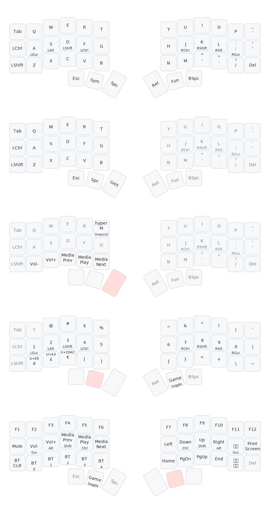

# My ZMK corne config

## Features

### homerow mods

- GASC order
- balanced behaviour
- quick tap

### game layer

- disables homerow mods for left half
- spacebar in better position when fingers are on wasd
- minimal function layer for quick media controls without having to leave game layer

### no nice!view

I don't have displays, so nice!views aren't configured

## Layout

[link to keymap generator](https://keymap-drawer.streamlit.app/)  
This tool supports importing ZMK configs, but I chose to customise the input so it looks a bit
cleaner. I've included this file in the repo as layout.svg.
